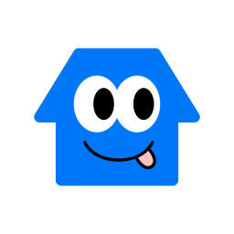

  

  <h1>한주헌 iOS Developer Portfolio</h1>

  

    Swift와 UIKit 기반으로 Local First 재고 관리 앱을 개발하며, 
    <strong>데이터 흐름을 예측 가능하게 만들고 변경에 강한 구조</strong>를 고민합니다.
  

  

    <a href="https://tyrhanz.github.io/portfolio/">Portfolio</a>
    ·
    <a href="https://github.com/TyrHanz">GitHub</a>
    ·
    <a href="mailto:skyofhan@naver.com">Email</a>
  

---

## Tech Stack

## Project 01. 쟁여

> 식재료와 생활용품의 재고와 유통기한을 놓치기 쉬운 사용자를 위해, 보유 물품을 빠르게 등록하고 현재 재고 상태를 한눈에 관리할 수 있도록 돕는 iOS 재고 관리 앱입니다.

| 항목 | 내용 |
| --- | --- |
| 기간 | 2026.03.31 - 2026.05.07, 약 6주 |
| 팀 | iOS 개발 2명, 디자이너 1명 |
| 담당 | 마이페이지, 재고화면, 상품상세화면, 검색화면, 구매예정화면 |
| 핵심 구조 | Local First, CoreData, NSFetchedResultsController, RxSwift, MVVM, Coordinator, DI |
| 링크 | [GitHub](https://github.com/JAENGYEO/JaengYeo) · [App Store](https://apps.apple.com/app/id6763179807) |

### What I Focused On

- CoreData 변경 감지를 `NSFetchedResultsController`와 RxSwift 흐름으로 연결해 재고 목록이 안정적으로 갱신되도록 구성했습니다.
- ViewModel을 `Input` / `Output` 구조로 두고, 검색어 변경과 필터 선택 같은 사용자 이벤트를 일관된 방식으로 처리했습니다.
- Coordinator와 DI를 적용해 화면 전환과 의존성 생성 책임을 ViewController 밖으로 분리했습니다.
- DTO, Payload, Domain 모델을 구분하며 계층 분리의 장점과 한계를 함께 경험했습니다.

## Portfolio Structure

- `index.html` 하나로 GitHub Pages에 배포할 수 있는 정적 포트폴리오입니다.
- `About Me`는 문장형 자기소개와 스킬 그룹을 2열로 구성했습니다.
- `Projects`는 `Project 01` 헤더, 프로젝트 정보 그리드, 트러블슈팅 카드 4개가 한 세트로 보이도록 구성했습니다.
- 새 프로젝트를 추가할 때는 `#projects` 섹션의 `article.project-set` 블록을 복사해 내용만 바꾸면 됩니다.

## Contact

- Email: [skyofhan@naver.com](mailto:skyofhan@naver.com)
- GitHub: [github.com/TyrHanz](https://github.com/TyrHanz)
- Portfolio: [tyrhanz.github.io/portfolio](https://tyrhanz.github.io/portfolio/)
